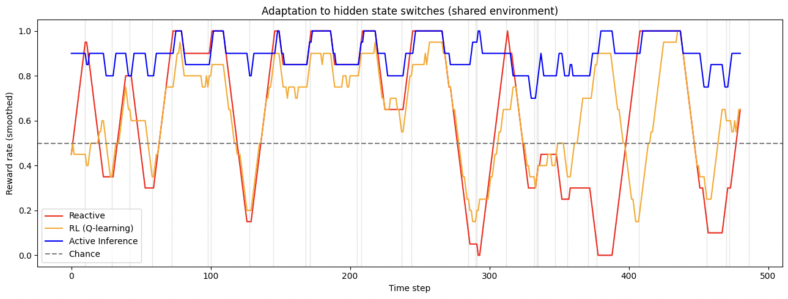

# Active Inference vs RL in Hidden-State Environments

A computational simulation comparing three adaptive agents on a non-stationary hidden-state switching task. Built as a preparatory project for the Neuromatch AI Sentience Scholar program

---

## Research Question:
Is  adaptation in living neural systems better explained by:

- Reactive mechanisms (respond to the most recent outcome)
- Reinforcement learning (learn action values from reward feedback)
or
- Active inference (maintain structured beliefs about hidden world states and act to minimise surprise)

This simulation provides a manageable, testable hypothesis for that question in a computational setting.

---

## Methods

Agents operate in a two-state hidden environment where the rewarded action switches stochastically (p = 0.05 per step). The hidden state is never directly observed — agents can only see whether their action was rewarded (left or right)

---

## The Three Agents for Comparison

### Reactive Agent
Selects actions based on a short recent reward history window. No internal model, no memory beyond the last few steps. Cannot reason about why the environment changed.

### RL Agent (Q-learning)
Maintains Q-values for each action and updates them from reward feedback (`lr=0.05`, `ε=0.20`). Adapts eventually but must slowly unlearn old values after each switch.

### Active Inference Agent
Maintains a Bayesian belief distribution over the two hidden states, updated at every timestep via likelihood and transition matrices. Acts by maximising expected reward under the current belief. Adapts rapidly.

---

## Results

Evaluated with 500 timesteps and a shared environment 

| Agent | Mean Reward ± Std | Recovery Time (steps) |
|---|---|---|
| **Active Inference** | **0.893 ± 0.070** | **0.0** |
| RL (Q-learning) | 0.630 ± 0.214 | 7.7 |
| Reactive | 0.637 ± 0.313 | 13.3 |

Statistical tests (independent samples t-test):
- AI vs RL: `t(960) = 25.55, p < 0.001`
- AI vs Reactive: `t(960) = 17.46, p < 0.001`

**Recovery time** measures how many steps each agent takes to return above chance (0.5) following a hidden state switch. Active inference recovers in 0.0 steps, which means its belief update is sufficient to adapt immediately, without requiring post-switch experience.

---

## Conclusion

Active inference agents recover faster after hidden state switches because they maintain explicit beliefs about latent world states. When the environment switches, the belief update happens immediately from a single observation, whereas RL must gradually recalculate old Q-values and reactive agents must accumulate new history. 

